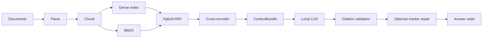

# RAG Document Intelligence

Local-first research assistant for asking questions over **your own documents**. It retrieves evidence with hybrid search, reranks candidates, builds a citation-tagged context, and answers from a local LLM with fail-closed citation checks.

This is a **single-user desktop/lab application**, not a hosted SaaS. Do not expose it directly to the public internet.

## What it does

- Ingest one or more PDF, Markdown, or plain-text documents
- Structure-aware chunking with locators
- Dense retrieval (BGE embeddings + local Qdrant) and BM25, fused with RRF
- MiniLM cross-encoder reranking
- Citation-aware context (`[S1]`, `[S2]`, …)
- Grounded generation with `qwen2.5-coder:7b` via Ollama
- Bounded citation-marker repair (second model call only when `[S#]` is missing)
- Persistent research sessions, including whether a conversation searches **all current documents** or a saved subset
- Document selection so answers stay inside the chosen subset
- History and New research as separate actions

## Architecture



Follow-ups:

```text
History → QueryResolver → retrieval query
History is not inserted into evidence.
```

Details: [docs/ARCHITECTURE.md](docs/ARCHITECTURE.md).

## Grounding and citations

Answers must be supported by the constructed context. Inline `[S#]` IDs are validated against that bundle. Unknown IDs fail closed. Missing markers yield an **unverified** state rather than a silent “grounded” badge.

A valid `[S#]` means the ID exists in context. It does **not** prove the passage semantically entails the claim.

## Evaluation

On **qualitybench_v1** (57 synthetic test questions; 50 answerable, 7 unanswerable), the current configuration reached gold evidence in the context bundle for **50/50** answerable items, produced **0/7** false answers on unanswerable items, and **3/3** leak-control abstentions. Among answers that needed citations, coverage was **35/43 (~81%)** with **0** invalid IDs and **0** malformed outputs. Product GROUNDED / UNVERIFIED / insufficient-evidence was **35 / 8 / 14**. Under the project’s lexical support audit, **33/35** GROUNDED answers were supported; **7/50** answerable items still false-abstained with gold in context.

**81% is citation coverage among answerable non-abstaining items, not overall accuracy.**

See [docs/EVALUATION.md](docs/EVALUATION.md).

## Performance (one local machine)

Latency is dominated by local 7B generation, not retrieval. On a focused product-path slice: hybrid retrieval ~13.5 ms, rerank ~19.4 ms, first generation pass ~5.4 s, citation repair when invoked ~6.2 s, warm end-to-end median ~8.2 s, first request after load ~30 s. Numbers depend on hardware and model load state.

## Tech stack

Python 3.11+, FastAPI, SQLite, embedded Qdrant, sentence-transformers (`BAAI/bge-small-en-v1.5`, `cross-encoder/ms-marco-MiniLM-L-6-v2`), Ollama (`qwen2.5-coder:7b`), React + TypeScript + Vite.

## Quick start

**Requirements:** Python 3.11+, Node 24+, [Ollama](https://ollama.com) with `qwen2.5-coder:7b` to **answer** questions. Embedding and reranker weights download from Hugging Face on first use unless already cached. CPU inference works; a GPU is faster but not required. Tests do not need Ollama, GPU, or network.

```bash
python -m pip install -e ".[dev]"
npm --prefix web install
ollama pull qwen2.5-coder:7b
python -m research_assistant serve
# another terminal
npm --prefix web run dev
```

Open http://127.0.0.1:5173 (Vite proxies `/api` to http://127.0.0.1:8000).

```bash
python scripts/check_environment.py
curl -s http://127.0.0.1:8000/health
curl -s http://127.0.0.1:8000/ready
```

`/health` is process liveness. `/ready` means SQLite, the vector store, and the LLM HTTP endpoint are reachable — not that the model is already loaded in VRAM.

Helpers: `./scripts/dev.sh api` and `./scripts/dev.sh ui`.

Copy `.env.example` to `.env` as a key list. The process does **not** auto-load `.env`; export variables in your shell.

Demo walkthrough and sample files: [docs/DEMO.md](docs/DEMO.md), [examples/demo_documents/](examples/demo_documents/).

### Docker

```bash
docker compose up --build
```

The API image does not bundle Ollama. Point `RESEARCH_ASSISTANT_LLM_BASE_URL` at host Ollama (`http://host.docker.internal:11434/v1`).

## Project structure

```text
src/research_assistant/   RAG pipeline + HTTP API
web/                      Vite/React workspace
tests/                    Offline pytest + Vitest
evaluation/               Synthetic benchmarks and runners
examples/demo_documents/  Safe demo corpus
docs/                     Architecture, evaluation, demo
scripts/                  Environment check and helpers
```

## Tests

Offline (no Ollama, no GPU, no paid APIs):

```bash
python -m pytest
python -m compileall -q src tests scripts evaluation
npm --prefix web test
npm --prefix web run typecheck
npm --prefix web run lint
npm --prefix web run build
```

Runs that call `qwen2.5-coder:7b` are **optional** evaluation, not part of CI.

## Known limitations

- Local, single-user, **no authentication**, no rate limiting, no in-app TLS
- Not public-internet hardened
- On qualitybench_v1: 7/50 gold-in-context false abstentions; some phrase sensitivity; some incomplete multi-source answers
- Valid citation IDs are not semantic entailment; conflicts can collapse to one side or abstain
- Citation repair may change wording; it does not prove support
- Local 7B decode takes seconds; the first request after model load can take much longer
- Benchmarks are small and synthetic
- Ingestion is text-layer PDF/Markdown/plain text. Scanned/OCR PDFs, complex tables, multi-column layouts, and figures are not extracted as searchable text.

## Security / deployment scope

Do not publish this process on the open internet without additional controls (auth, TLS, network isolation). The supported mode is **private local use**.

## License

This project is licensed under the MIT License. See [LICENSE](LICENSE).
