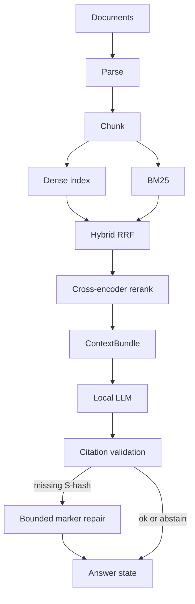
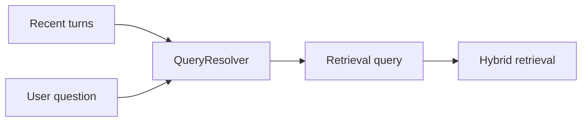

# Architecture

Local RAG pipeline: ingest documents, retrieve evidence, generate a citation-checked answer. Stages are independently replaceable. Conversation history rewrites the search query; it is never mixed into evidence.

## Pipeline

History is **not** a document. Prior answers are not retrieved as evidence.

## Stages

| Stage | Role |
| --- | --- |
| Ingestion | Validate upload, checksum, parse TXT/MD/PDF, persist provenance in SQLite |
| Chunking | Structure-aware chunks with filename, page/section locators |
| Embeddings | `BAAI/bge-small-en-v1.5` (sentence-transformers), process-cached |
| Dense index | Embedded Qdrant on disk |
| Lexical | BM25 over chunks from complete, searchable document indexes |
| Fusion | Reciprocal rank fusion (RRF) |
| Rerank | `cross-encoder/ms-marco-MiniLM-L-6-v2`; logits are not probabilities |
| Context | Token-budgeted bundle with `[S#]` tags |
| Generation | Ollama Chat Completions, default `qwen2.5-coder:7b`, JSON object protocol |
| Validation | Inline `[S#]` must exist in the bundle; unknown IDs fail closed |
| Repair | At most one extra model call when markers are missing; Python never appends `[S1]` |
| Sessions | SQLite turns for display and query rewrite only |

Default retrieval/chunking/embedding/rerank/context-budget knobs are treated as a frozen quality configuration.

## Document index readiness and recovery

Ready is checked per document and current embedding/chunker identity. A shared
collection's status or a SQLite chunk count does not establish document readiness.
The health service compares current SQLite chunk IDs with vector payload IDs,
chunker identity, and content hashes, and requires a completed indexing attempt
for the same source checksum. List, details, Re-index, dense search, and BM25 use
this rule. Chunking alone no longer makes a document lexically searchable.

SQLite schema 5 adds document/index attempt records. The additive migration keeps
documents, chunks, sessions, and turns. Existing ready collections receive
unverified per-document records: each document still needs an exact live vector
match before it is considered Ready. Existing failed/building collections require
Re-index. Startup is idempotent and does not recreate these records on every run.

An attempt is persisted as building before vector changes and activated only after
all writes and identity verification succeed. Failed or interrupted attempts stay
excluded from every retrieval mode, including when partial vectors remain on disk
or another document indexes successfully. If the final SQLite activation fails,
complete vectors alone cannot make the document Ready. Re-index replaces that
document's points and retries activation; it skips work only for a healthy document.
Removal purges its vectors and cascades its SQLite chunks and attempt records.

SQLite and Qdrant do not share a transaction. This design fails closed; it does not
retain a separately staged previous representation during a rebuild. Health is a
point-in-time check, not snapshot isolation against concurrent mutations.
Library checks use one paginated payload inventory, without vectors, rather than
one Qdrant request per document. Details and Re-index inspect the selected document.
Retrieval also verifies the inventory (twice for hybrid's two branches), so cost
grows with corpus size; a future incremental scheme must preserve these guarantees.

## Product API

- `GET /health` — process liveness
- `GET /ready` — SQLite, vector store, and LLM HTTP endpoint (not “model already in VRAM”)
- `/api/documents`, `/api/sessions`, `/api/ask`

The Vite UI talks to the API on `127.0.0.1:8000` (dev proxy for `/api`).

## What this is not

- Not a public multi-tenant service
- Not a semantic entailment judge (valid `[S#]` ≠ the claim is supported)
- Not streaming: the UI waits for a validated JSON answer so uncited text is not shown as grounded
