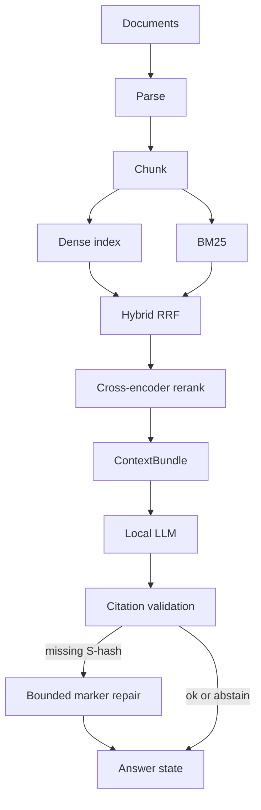
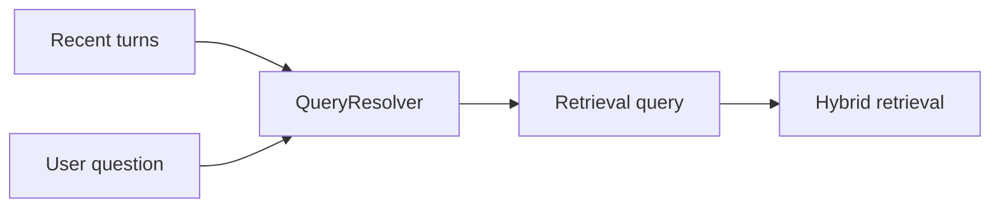

# Architecture

Local RAG pipeline: ingest documents, retrieve evidence, generate a citation-checked answer. Stages are independently replaceable. Conversation history rewrites the search query; it is never mixed into evidence.

## Pipeline





History is **not** a document. Prior answers are not retrieved as evidence.

## Stages

| Stage | Role |
| --- | --- |
| Ingestion | Validate upload, checksum, parse TXT/MD/PDF, persist provenance in SQLite |
| Chunking | Structure-aware chunks with filename, page/section locators |
| Embeddings | `BAAI/bge-small-en-v1.5` (sentence-transformers), process-cached |
| Dense index | Embedded Qdrant on disk |
| Lexical | BM25 over chunks from complete, searchable document indexes |
| Fusion | Reciprocal rank fusion (RRF) |
| Rerank | `cross-encoder/ms-marco-MiniLM-L-6-v2`; logits are not probabilities |
| Context | Token-budgeted bundle with `[S#]` tags |
| Generation | Ollama Chat Completions, default `qwen2.5-coder:7b`, JSON object protocol |
| Validation | Inline `[S#]` must exist in the bundle; unknown IDs fail closed |
| Repair | At most one extra model call when markers are missing; Python never appends `[S1]` |
| Sessions | SQLite turns for display and query rewrite only |

Default retrieval/chunking/embedding/rerank/context-budget knobs are treated as a frozen quality configuration.

## Document index readiness and recovery

Ready is checked per document and current embedding/chunker identity. A shared
collection's status or a SQLite chunk count does not establish document readiness.
The health service compares current SQLite chunk IDs with vector payload IDs,
chunker identity, and content hashes, and requires a completed indexing attempt
for the same source checksum. List, details, Re-index, dense search, and BM25 use
this rule. Chunking alone no longer makes a document lexically searchable.

SQLite schema 5 adds document/index attempt records. The additive migration keeps
documents, chunks, sessions, and turns. Existing ready collections receive
unverified per-document records: each document still needs an exact live vector
match before it is considered Ready. Existing failed/building collections require
Re-index. Startup is idempotent and does not recreate these records on every run.

An attempt is persisted as building before vector changes and activated only after
all writes and identity verification succeed. Failed or interrupted attempts stay
excluded from every retrieval mode, including when partial vectors remain on disk
or another document indexes successfully. If the final SQLite activation fails,
complete vectors alone cannot make the document Ready. Re-index replaces that
document's points and retries activation; it skips work only for a healthy document.
Removal purges its vectors and cascades its SQLite chunks and attempt records.

SQLite and Qdrant do not share a transaction. This design fails closed; it does not
retain a separately staged previous representation during a rebuild. Health is a
point-in-time check, not snapshot isolation against concurrent mutations.
Library checks use one paginated payload inventory, without vectors, rather than
one Qdrant request per document. Details and Re-index inspect the selected document.
Each API ask shares one health inspection between scope resolution and both
retrieval branches, using a context-local snapshot released on success or failure.
There is no cache across requests. Standalone hybrid retrieval outside this API
context still inspects twice, and BM25 still reads SQLite chunks for its corpus
fingerprint. Inventory cost grows with corpus size; a future incremental scheme
must preserve these guarantees.

## Saved document scope

Session scope is a server-enforced boundary, represented by the existing
`all_documents` and `selected_document_ids` fields (no schema change):

| Mode | Persisted form | Ask behavior |
| --- | --- | --- |
| ALL | `true`, `[]` | Current searchable documents, including later successful uploads |
| SUBSET | `false`, nonempty IDs | Exactly those documents; never expands on upload or deletion |
| NONE | `false`, `[]` | `409 no_documents_selected`, before retrieval, reranking, or generation |

Creation and deliberate selection updates validate known document IDs and remove
duplicates while preserving first-occurrence order. Session reads retain deleted
IDs and report `missing_selected_count`; the UI displays surviving checkboxes and
a missing-document notice. A missing, failed, building, or incomplete selected
document makes SUBSET fail closed with `409 selected_documents_unavailable`.
The user must update the selection or repair the documents. ALL skips unready
documents and returns `409 no_ready_documents` if none are searchable.

For `/api/ask` with `session_id`, persisted scope is authoritative. Omit legacy
`document_ids` to use it. If supplied, their normalized set must exactly match the
effective saved scope, or the request returns `409 scope_mismatch`; an explicit
empty list cannot bypass SUBSET. Without a session, omitted/empty IDs retain the
legacy dynamic ALL behavior and nonempty IDs specify a validated subset.

Each ask resolves a nonempty immutable ID tuple before entering the RAG pipeline;
later session PATCHes cannot change that request's filter. Retry resolves the
current saved scope. Historical per-turn scope snapshots/replay remain future
work, and this boundary does not redact already saved answers or history.

The UI captures and serializes selection PATCHes per session and waits for the
newest intended save before Ask. Failed saves are visible and block Ask until a
new selection saves successfully. New research remains local until its first
question, which creates the session with its current scope. Changes during that
creation are saved before asking. Individual document toggles select a fixed
subset; the master checkbox explicitly chooses dynamic ALL. This ordering covers
one browser instance; concurrent clients still use the latest persisted scope,
without revisions or cross-store transaction isolation.

## Product API

- `GET /health` — process liveness
- `GET /ready` — SQLite, vector store, and LLM HTTP endpoint (not “model already in VRAM”)
- `/api/documents`, `/api/sessions`, `/api/ask`

The Vite UI talks to the API on `127.0.0.1:8000` (dev proxy for `/api`).

## Local deployment boundary

Native API processes default to `127.0.0.1:8000`. The bundled Docker frontend uses
the same origin as the API:

```text
Browser -> host 127.0.0.1:8000 -> Docker bridge forwarding -> container 0.0.0.0:8000
Application -> embedded Qdrant files under /app/data/indexes/qdrant
```

The container's wildcard listener enables forwarding; the loopback host
publication limits default network exposure. The non-root API drops Linux
capabilities while retaining writable data, home,
and temporary paths. Existing bind mounts persist SQLite, uploads, and indexes.

The opt-in `qdrant-server` profile provides a separate loopback-published server
for manual experiments. No application code connects to it. Ollama remains on
the host; `host.docker.internal` connectivity depends on host binding and platform.
See [Docker setup and caveats](../README.md#docker). Neither CORS nor these local
deployment defaults provide authentication for a remote or multi-user service.

## What this is not

- Not a public multi-tenant service
- Not a semantic entailment judge (valid `[S#]` ≠ the claim is supported)
- Not streaming: the UI waits for a validated JSON answer so uncited text is not shown as grounded
