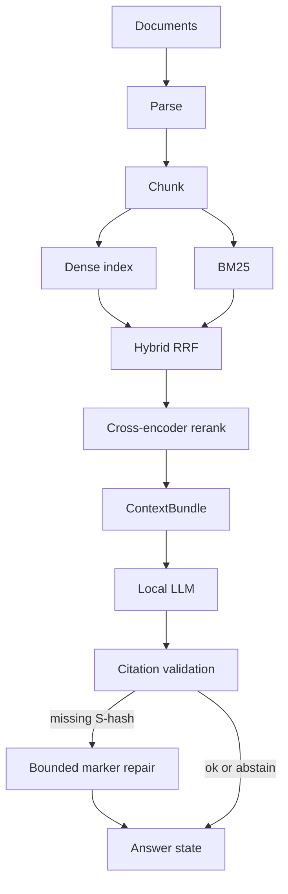
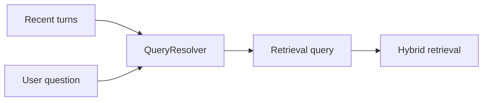

# Architecture

Local RAG pipeline: ingest documents, retrieve evidence, generate a citation-checked answer. Stages are independently replaceable. Conversation history rewrites the search query; it is never mixed into evidence.

## Pipeline

History is **not** a document. Prior answers are not retrieved as evidence.

## Stages

| Stage | Role |
| --- | --- |
| Ingestion | Validate upload, checksum, parse TXT/MD/PDF, persist provenance in SQLite |
| Chunking | Structure-aware chunks with filename, page/section locators |
| Embeddings | `BAAI/bge-small-en-v1.5` (sentence-transformers), process-cached |
| Dense index | Embedded Qdrant on disk |
| Lexical | BM25 over the same chunks |
| Fusion | Reciprocal rank fusion (RRF) |
| Rerank | `cross-encoder/ms-marco-MiniLM-L-6-v2`; logits are not probabilities |
| Context | Token-budgeted bundle with `[S#]` tags |
| Generation | Ollama Chat Completions, default `qwen2.5-coder:7b`, JSON object protocol |
| Validation | Inline `[S#]` must exist in the bundle; unknown IDs fail closed |
| Repair | At most one extra model call when markers are missing; Python never appends `[S1]` |
| Sessions | SQLite turns for display and query rewrite only |

Default retrieval/chunking/embedding/rerank/context-budget knobs are treated as a frozen quality configuration.

## Product API

- `GET /health` — process liveness
- `GET /ready` — SQLite, vector store, and LLM HTTP endpoint (not “model already in VRAM”)
- `/api/documents`, `/api/sessions`, `/api/ask`

The Vite UI talks to the API on `127.0.0.1:8000` (dev proxy for `/api`).

## What this is not

- Not a public multi-tenant service
- Not a semantic entailment judge (valid `[S#]` ≠ the claim is supported)
- Not streaming: the UI waits for a validated JSON answer so uncited text is not shown as grounded
