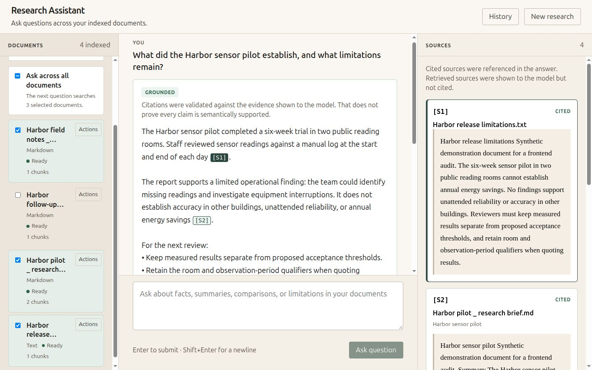
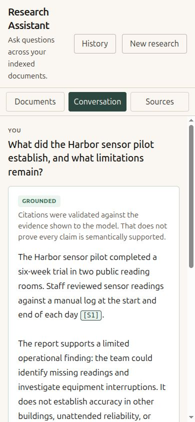

# Frontend Product Audit

## Executive summary

The frontend has a credible research workflow and a useful visual starting point. Its strongest assets are persistent conversations, explicit document scope, distinct answer-validation states, and inspectable evidence. The next investment should make those capabilities easier to understand and navigate. A replacement application, new styling framework, or generic chat interface would discard working behavior without solving the main problems.

Keep the three-pane desktop workspace when there is enough reading width. Make documents and evidence deliberate, accessible destinations at narrower widths. Establish a visible session title and scope near the question, simplify answer hierarchy, and make the answer-to-evidence round trip work with both keyboard and touch.

The immediate usability blockers are modal focus escaping into the background, the cramped/mobile workspace shell, and loss of context when navigating citations. These are P0 product-polish findings, not claims of backend defects or a security severity rating. Seven focused implementation PRs are proposed below; this audit implements none of them.

**Inspection baseline.** Source: `ec24515cac675f61fe9dd57de8ad44043232cf5b`, verified as current `origin/main` before branching. Its post-merge [CI run succeeded](https://github.com/korakdas1/rag-document-intelligence/actions/runs/37222941337). Inspection took place on October 4–5, 2026. The production frontend build (`npm --prefix web run build`) also passed locally.

**Method and limits.** All production components, `App.tsx`, CSS, entry point, API clients/types, scope/scroll/upload helpers, and frontend test contracts were inspected. The current production build ran against the existing application/API with fresh temporary storage and four synthetic Harbor pilot documents. Existing injection points supplied hashing embeddings, an overlap reranker, and scripted responses. The UI, persistence, source rendering, and request/error paths were real; response content and timings are demonstration fixtures, not RAG quality or performance measurements. No existing research data was used or altered.

Browser checks covered empty and populated workspaces, subset selection, persistence after reload, history/search, document details, long cited answers, citation navigation, diagnostics, waiting, insufficient/unverified responses, a provider error, and retry. Viewports inspected: 1920×1080, 1440×900, 1080×800, 1024×768, and 390×844. Viewport emulation is not a physical-device or screen-reader test. Native file selection opened, but file transfer was blocked by the browser extension's file-access setting; the safe documents were instead uploaded through the existing local API. Picker completion, OS drag/drop, real PDF extraction, real provider latency, large libraries, and real mobile keyboards were not demonstrated in this audit. Their existing code/tests informed the assessment.

Seven unmodified current-UI captures total approximately 723 KiB. They contain only synthetic material:

| Reference | Viewport and state | What it demonstrates |
| --- | --- | --- |
| [01 Empty desktop](assets/frontend-audit/01-empty-desktop.png) | 1440×900, fresh storage | Calm palette, repeated onboarding, large idle regions |
| [02 Desktop research](assets/frontend-audit/02-desktop-research.png) | 1440×900, three selected documents, long scripted answer | Filename truncation, answer hierarchy, simultaneous evidence; library is scrolled |
| [03 Document details](assets/frontend-audit/03-document-details.png) | 1440×900, metadata dialog | Useful metadata hierarchy and subdued advanced disclosure |
| [04 Diagnostics](assets/frontend-audit/04-desktop-diagnostics.png) | 1440×900, expanded and scrolled to validation/table | Dense but valuable advanced data; horizontal table scrolling |
| [05 Tablet library](assets/frontend-audit/05-tablet-library-overlay.png) | 1024×768, Documents selected | Library overlays still-visible conversation without a scrim |
| [06 Mobile conversation](assets/frontend-audit/06-mobile-conversation.png) | 390×844, long answer | Oversized header, missing visible scope/title, composer below the fold |
| [07 Mobile evidence](assets/frontend-audit/07-mobile-evidence.png) | 390×844, citation opened | Active source without question context or a direct return action |

## Current product structure

The application is a single React workspace. There is no route hierarchy or separate library page. The current task model is: add documents, establish a scope, ask, inspect the answer and evidence, then continue or return to a saved conversation.

| Area | Current responsibility | Principal implementation |
| --- | --- | --- |
| Header | Product identity, History, New research | `App.tsx`, `SessionSwitcher.tsx` |
| Left pane | Upload, search filenames, select scope, document actions | `DocumentSidebar.tsx`, `DocumentActions.tsx` |
| Center | Ordered turns, retry, advanced diagnostics, question input | `ConversationTurn.tsx`, `AnswerCard.tsx`, `DiagnosticsPanel.tsx`, `QuestionInput.tsx` |
| Right pane | Sources for the active turn, cited/retrieved state and passage | `SourcePanel.tsx` |
| Overlays | Details, remove document, rename/delete session, details error | Four dialog components plus markup in `App.tsx` |
| Narrow navigation | Documents / Conversation / Sources buttons | `App.tsx`, final media queries in `index.css` |
| Coordination | Data loading, sessions, scope saves, uploads, request lifecycle, scrolling | `App.tsx`, `documentScope.ts`, `conversationScroll.ts`, `useFileDrop.ts` |

API boundaries are already clear: document list/detail/upload/reindex/remove; session list/create/load/patch/delete; ask with saved session scope; health/readiness. `api/types.ts` separates document status, answer grounding/validation, source provenance, saved turns, and diagnostics. Product work should consume these contracts without changing their meanings.

## Current strengths

- **Research remains document-centered.** Scope, question, and evidence coexist on desktop; sources are not buried in a generic chatbot footer.
- **Trust states are honest.** Grounded, unverified, insufficient, malformed, and technical failures are distinct. Grounded copy correctly limits the claim to citation validation, not proof of semantic support.
- **Persistence and scope have substantial protection.** All-documents, a fixed subset, and no selection are distinct. Saves are serialized; Ask waits for the latest scope save and does not submit on a failed save. Session changes guard against stale loads.
- **Evidence retains provenance.** Filenames, page/section locators, cited versus retrieved markers, and removed-document labels support inspection. Clicking a citation activates and scrolls its source.
- **Recovery is a first-class behavior.** Retry preserves persisted turn identity; duplicate requests are guarded. Uploads can partially succeed, reindex failures are visible, and destructive actions require confirmation.
- **The visual foundation is restrained.** Warm neutrals, dark green accents, bounded reading width, visible focus outlines, and serif passages already suggest a research tool. These are useful foundations to refine.
- **Advanced information is retained without being initially expanded.** Request diagnostics and document internals are available on demand.
- **Tests defend meaningful behavior.** Assertions cover scope races, persistence, uploads, failed retries, source linkage, and intentional scroll behavior, not just rendered labels.

## Current visual/product weaknesses

The first impression is functional and serious, but still resembles an internal workspace. Too many surfaces and explanatory paragraphs have similar weight. The most important context—what research session this is and which documents the next question will use—is not presented as a stable workspace heading.

The five largest problems are:

1. **Research context is hidden.** The active title is only the History button's tooltip; scope is confined to the library. An older answer's sources have no visible question/turn heading.
2. **Responsive behavior changes the interaction model unexpectedly.** At 1080px three columns remain; at tablet width Documents becomes an overlay while Conversation and Sources remain visible; mobile becomes exclusive panes.
3. **Evidence navigation is one-way.** Citation activation selects the correct source, but there is no direct return to the originating answer or reliable focus transfer after changing panes.
4. **Visual density prioritizes scaffolding over content.** Repeated grounding explanations precede each answer, document Actions buttons compete with filenames, and sources nest a bordered card around another shaded passage surface.
5. **State and accessibility polish is uneven.** Modals do not contain focus, saving/loading states are not clearly differentiated, and some empty/error messages are misleading or too technical.

The empty desktop view is calm but repeats upload guidance in two panes while showing an unusable composer and empty evidence region. Keep onboarding concise and directional; do not add decorative hero graphics or invented example research results.

## Information architecture

**Retain three panes on wide desktop, with the conversation as the primary region.** Documents are the research inputs; evidence is the inspection companion. Neither should be permanently sacrificed for a larger chat column. Use collapsible side panes and content-driven breakpoints so three panes appear only when the center retains a comfortable reading width.

Recommended hierarchy:

- A compact product header with History and New research.
- A visible workspace title beneath or within that header, followed by a scope summary such as “3 selected documents.” Scope must distinguish all documents from a fixed subset containing every current document.
- A conversation reading area and composer that share the same measure and clearly expose the next question's scope.
- An evidence heading that names the selected question/turn, with passage counts and a return-to-answer action.
- Advanced retrieval controls and request diagnostics in a secondary disclosure, with “settings for the next question” separated from “details of this answer.”

On tablet, favor conversation plus optional evidence. Open the library in a proper dismissible drawer, with an explicit close action and focus behavior, or replace the pane entirely at the narrower end. The selected navigation state must describe what actually changes. On mobile, keep exclusive panes, but retain a compact title/scope context and preserve each pane's scroll position. Citation navigation should be a reversible inspection step, not a change of research task.

History merits a stronger labeled destination and visible active title, not a permanent fourth column. A searchable history drawer/popover is sufficient for the current API and product size. URL routing/deep links can be a separate future decision; they are not prerequisites for this polish pass.

## Design-system audit

The existing system lives in [`web/src/index.css`](../web/src/index.css), currently 1,275 lines. It has useful tokens and mostly understandable selectors, rather than an irredeemable cascade. Its main weakness is that tokens, global elements, shell layout, dialogs, conversation, sources, diagnostics, and responsive overrides share one file.

| Category | Current inventory | Recommendation |
| --- | --- | --- |
| Base surfaces | `--bg #f1ece3`, `--panel #faf7f1`, `--surface/--elevated #fff` | Keep a warm canvas and clean reading surface; give each surface a named role |
| Text | `--ink #1a1814`, secondary `#3d3932`, muted `#5a5449` | Preserve strong text contrast; reserve muted text for metadata |
| Accent/interaction | Accent `#2a4740`, hover `#223b35`, focus `#1b4b61`, selected `#e4eee8`, hover surface `#efe8dc` | Keep restrained green; distinguish selection, focus, and validation |
| Borders | `#d6cebf`, stronger `#c0b6a4` | Separate decorative dividers from visible control boundaries |
| Grounded | `#276548` on `#eaf4ee` | Keep semantic label and calm tint, without suggesting factual certification |
| Unverified | `#8a5118` on `#f6eee3` | Keep distinct from technical error and abstention |
| Insufficient | `#65542c` on `#f3eee4` | Neutral evidence limitation, not success or system failure |
| Error | `#822821` on `#f6e8e6` | Use for actionable failure, with explicit recovery |
| Font families | Source Sans 3 → IBM Plex Sans → Segoe UI → system; Iowan/Palatino/Georgia passages; system mono for internals | No bundled/webfont loading found; system-dependent rendering is expected. Standardize the fallback strategy before considering a self-hosted font |
| Type | Root 16px; 17px at ≥1280px. Tokens `.8125/.9375/1.0625/1.22rem`; leading `1.6/1.32/1.7` | Use stable semantic text roles; review the abrupt whole-interface size jump |
| Small labels | Badges/headings around `.72rem`, tags `.7rem`, citation chips `.78em` | Reduce all-caps overuse and make provenance readable at ordinary zoom |
| Spacing | `.25/.5/.75/1/1.35/1.85rem` tokens, alongside many literal gaps/paddings | Keep a compact spacing scale and remove near-duplicate values gradually |
| Radius/shadow | 6px/4px; `0 1px 0 rgba(26,24,20,.04)` | Restrained corners; subtle elevation only for floating menus/dialogs |
| Controls | Main minimum height `2.4rem` (38.4/40.8px), menu controls `1.85rem` | Define compact desktop and comfortable touch variants; do not enlarge all rows indiscriminately |
| Reading measure | `44rem` (704/748px) | Keep bounded answers on wide displays; preserve a useful minimum center width |
| Breakpoints | ≥1280 root scale; ≥1440 wider side panes; ≤1079 tablet; ≤720 exclusive panes | Base collapse on usable center width; verify both sides of every boundary |
| Motion | Smooth source/turn scrolling; reduced-motion alternatives; no heavy animation | Preserve reduced motion; use short purposeful transitions only |

Hard-coded sidebar `#ece6db`, evidence/composer `#f4efe6`, passage `#f4efe4`, and semantic borders such as `#c5d8cc`, `#b3c9bb`, `#bfd6c6`, and `#e0c9a8` should become role tokens. White surfaces, selected/cited borders, badges, and input styling recur across separate components. Normalize these through a small shared layer; avoid a broad “card” abstraction that conflates selectable documents, answers, and evidence.

Radii are already reasonably consistent. Spacing and density need more attention than a wholesale radius change. Cascade risks are shared descendant rules for dialog/history inputs, overlapping hover/selected/active styles, and late media overrides. Split CSS by responsibility only as each area changes—tokens/base, controls/dialogs, shell, library, conversation, evidence, diagnostics—with an explicit import order. Do not move every rule in a cosmetic-only commit that obscures the actual visual delta.

## Conversation experience

User questions have a strong “You” label and larger text. This makes turn boundaries understandable, but long questions can compete with the answer. Answers currently start with a status badge and a full explanation on every turn. In the mobile capture this pushes substantive text well down the screen.

Keep the status visible; make the answer the primary reading content. Use concise status text with an accessible explanation disclosure. The statement that citation validation does not prove semantic support must remain available and accurate. Never relabel unverified or insufficient answers as successful because their container looks nicer.

`AnswerCard` renders a single paragraph of citation-split spans using preserved whitespace. Paragraph breaks remain readable, but lists/headings/tables have no structural rendering. Improve paragraph rhythm and long-answer spacing first. If richer formatting is later required, specify a restricted format, safe link handling, and citation preservation before selecting a renderer. Arbitrary model-supplied HTML must not become part of the design.

Multi-turn reading needs an explicit active-turn treatment. Selecting a citation in an earlier answer should identify that turn above the evidence, while leaving the rest of the conversation legible. A modest copy-answer action is useful as P2; it should preserve plain text and citation markers and announce completion.

The desktop composer is a stable dock; its three-row field is generous even when idle. On mobile it follows the full answer content: with the inspected 390×844 long answer, the textarea started around y=1239px. The header/nav consumed approximately 231px before reading began. A compact, bounded composer and flexible-height shell should improve this without covering the answer or trapping the on-screen keyboard.

Preserve Enter to submit, Shift+Enter for newline, empty/scope guards, single-submit behavior, retry identity, and the typed-question persistence contract. Check composition events before enabling Enter submission for IME users; `QuestionInput` currently checks Enter/Shift but not composition state. This is a code-review concern, not a reproduced IME failure.

During the scripted slow response the UI showed two `role=status` “Working…” messages plus the disabled submit button. Prefer one intentional announcement and concise activity feedback near the pending turn. Show “Saving document selection” when that is the actual prerequisite; do not invent retrieval/generation progress percentages that the API does not expose. Cancellation/streaming are separate API features, not cosmetic controls to add without support.

Current scrolling is deliberately more sophisticated than “always jump to bottom.” `conversationScroll.ts` and `App.tsx` pin a newly submitted/retried turn near the top, add bounded trailing space, respect manual upward scrolling, and avoid jumping on restore or passive diagnostic toggles. Preserve those contracts. Inspect the resulting whitespace on short answers, and use real-browser geometry in addition to the mocked layout tests.

## Document experience

Upload supports multiple PDF, Markdown, and text files and a full-workspace drop target. Sequential batches continue after individual failures. The code preserves successful uploads even if the following library refresh fails, and sanitizes resource-exhaustion dumps. These are valuable behaviors to keep.

The library is visually expensive for only four documents. A permanently visible Actions button compresses filenames into two short lines, while type, ready state, chunk count, and duplicate identifiers add metadata below. Selected rows share a broad green tint, creating large blocks of equal visual weight. Prioritize filename and readiness; keep secondary metadata compact and move technical counts to details unless needed for recovery. A compact labeled action button can help, but actions must remain discoverable by keyboard and touch, not hover alone.

The master checkbox correctly exposes mixed selection. Its copy distinguishes the next question's scope. Preserve all/subset/none even when a fixed subset equals the entire current library: later uploads must join ALL but not a fixed subset or NONE. Filtering filenames must not silently redefine scope or make “select all” mean only the filtered rows. Add an explicit matching-results action only if it is separately labeled.

The pane header currently displays `documents.length + " indexed"`, irrespective of readiness. Use a truthful library total with ready/needs-attention counts derived from existing statuses. “1 chunks” should become “1 chunk.” Source-missing labels, warnings, and reindex restrictions should remain visible. Details already separates user metadata from parser/checksum/index internals; improve dates and spacing rather than removing the information.

Large-library behavior is a design and performance gap, not a measured failure: filtering is client-side by filename, all rows render, and duplicate-filename counts rescan the list per row. Start with efficient derived counts, a clear selection summary, and tested scroll/filter retention. Measure a synthetic 100/500-document fixture before deciding on virtualization. Do not introduce pagination that the current API does not implement.

Upload feedback currently expires after seven seconds, including errors. Retain unresolved failures until dismissed or resolved and offer a clear batch result summary. Keep upload errors, document-action errors, and details errors separate. Reindex should remain an explicit operation with per-document busy state and duplicate-click prevention; remove must remain confirmed. No deletion was performed during this audit.

## Citation/evidence experience

The source model is a product advantage: it includes citation ID, document ID/name, page range, section path, passage, `truncated`, and `cited_by_model`. The current UI distinguishes cited and retrieved passages, highlights the active citation, and retains evidence for documents removed from the library.

Improve the inspection loop without changing retrieval or attribution:

1. Show which question/turn the evidence belongs to. Label the count as passages, not an ambiguous bare number or a unique-document count.
2. Keep citation chips compact but recognizable, with descriptive accessible labels and a stable association with the current turn/source.
3. On keyboard activation that changes panes, move focus to the selected source heading/control. Preserve the originating chip and scroll position for “Back to answer.” Do not move focus merely because an answer arrives.
4. Keep filename and locator above the passage, reduce nested border/shaded-surface noise, and make passage selection/copy straightforward. The entire current source card is a button containing structured passage content; separate navigation from the reading region and verify the resulting accessibility tree with a screen reader.
5. Expose `truncated` when true. Do not imply that a shortened passage is the whole document or that text highlighting establishes semantic support.
6. Avoid interactive dead ends for unknown citation IDs. `splitCitations()` makes every `[S<number>]` marker interactive; `SourcePanel` silently finds no node if it is absent. Preserve the literal invalid marker and validation status, with non-navigable treatment or explicit unavailable feedback.

The mobile keyboard check activated `[S1]`, selected Sources and marked the correct source current, but focus fell back to the document body. The user must independently find the destination and then use the general Conversation tab to return. This is the clearest evidence-navigation P0.

Opening an original PDF at a cited page would be useful later, but no source-file viewer/download contract is currently exposed in the frontend API. Do not add a fake “Open original” control or expand backend scope during this polish sequence.

## Sessions/navigation

History is searchable, marks the active session, and supports rename/delete. New research starts a fresh draft and creates a persisted session on the first question. Reload restores saved turns and scope; a technical failure can be retried using its saved turn ID. These are important product strengths.

The active title is not visibly present outside History. Add a title hierarchy that makes “New research” versus an existing conversation obvious. Use a compact count and human-readable updated date in History; expose exact timestamps on demand. Move repeated destructive/rename actions into a secondary control where appropriate without losing discoverability.

A no-match query currently displays “No saved conversations yet” even though one exists; this was reproduced. Separate empty history, loading, failed loading, and no search results. Provide a clear-search path. History uses `role=menu` around a search field and mixed buttons without the keyboard navigation of a conventional menu. Prefer a labeled search/list popover or drawer with ordinary tab order, or implement a complete menu pattern; do not retain mismatched semantics.

Session loading disables Ask but has no equally clear visible loading treatment. Keep the current stale-load protections while presenting the transition. A title should never switch early in a way that makes old turns appear to belong to the new session.

## Loading/error/empty states

“Observed” below means exercised in the running isolated UI. “Reviewed” means established from component/API/test code, not reproduced live.

| State | Current behavior and evidence | Product treatment |
| --- | --- | --- |
| Fresh/empty | Observed: upload guidance in library and conversation; empty sources | One clear next action, quiet companion panes |
| Library initialization | Observed empty view briefly after reload; no explicit library-loading model | Distinguish loading from genuinely empty; avoid onboarding flash |
| Documents ready, no turns | Reviewed: question-ready empty conversation | Explain scope and the next action without fake results |
| No document selection | Reviewed tests: Ask disabled, explicit explanation | Keep this guard; expose recovery next to composer too |
| No filter/history matches | History reproduced misleading empty copy; document filter reviewed | Specific no-match message and clear search |
| Session loading/saving | Reviewed: loading guard and serialized scope-save queue; failed save alerts | Visible load/save/failure states with correct scope semantics |
| Uploading/batch result | Reviewed: per-file sequential progress, partial success, temporary feedback | Persistent actionable failures, concise batch summary; actual picker completion unverified |
| Asking | Observed: duplicated Working statuses, disabled field/submit | One announcement, pending turn, bounded composer; no fictitious progress |
| Reindexing | Reviewed: row busy state and duplicate blocking; failure retained | Keep local progress and explicit retry/recovery |
| Backend unavailable | Reviewed: banner includes `python -m research_assistant serve`; library error distinct from empty | Plain-language connection state with technical setup detail behind disclosure |
| Model/store degraded | Reviewed: differentiated health messages | Preserve distinction: indexing/search may still work when model is unavailable |
| Failed ask/retry | Observed scripted provider error and retry; five turns remained five | Keep question and error, actionable retry, no invented answer or duplicate turn |
| Stale/missing document | Reviewed: missing-selection count and removed-source tags | Explain current scope change while retaining historical evidence |
| Parser/index warnings | Reviewed: human-readable known warnings, raw codes in details | Prioritize actionable limitations; preserve unknown details without raw dumps in primary UI |
| Insufficient evidence | Observed: neutral badge, explanatory copy, response text | Distinguish evidence limitation from service failure; concise guidance |
| Unverified | Observed: warning badge and answer retained | Keep visibly cautionary, with evidence available |
| Invalid/malformed output | Reviewed tests: distinct status and evidence availability | Maintain honest failure label and appropriate recovery |
| Rendering failure | Reviewed: conversation error boundary | Keep recoverable shell; clear reload/retry guidance without obscuring saved work |

Use a common visual vocabulary for status, empty, and error states, but retain their different recovery actions. Status text must describe the operation actually in progress. Avoid universal success toasts and avoid exposing resource/provider internals unless useful to the user troubleshooting the local app.

## Responsive behavior

| Width/state | Current behavior and observed outcome | Proposed behavior |
| --- | --- | --- |
| 1920×1080 | Three panes; measured center 1206px, answer capped at 748px | Preserve readable measure; allow optional evidence/library collapse |
| 1440×900 | Three panes; simultaneous comparison is useful | Keep structure, reduce card chrome and make title/scope visible |
| 1080×800 | Still three panes: library 264px, center 440px, evidence 376px. Submit label wraps | Collapse a side pane before center reading becomes cramped |
| 1024×768 | Two underlying columns; Documents overlays 320px of conversation, without scrim/close button | Coherent drawer with explicit dismissal/focus, or exclusive pane when necessary |
| 390×844 | Exclusive panes, no observed body horizontal overflow; header ≈175px; composer below long answer | Compact header, stable context, controlled reading scroll and reachable composer |
| Mobile citation | Correct source selected; source heading may scroll out of view; keyboard focus becomes body | Selected-question/source context plus focus transfer and return action |

The ≤720px rules use `calc(100dvh - 7.5rem)` despite a wrapping header and possible status banners. Use actual flex/grid allocation instead of subtracting an assumed header height. A resizable textarea has no explicit maximum height; bound it so the reading area remains usable.

Do not claim that the current UI is broken at every narrow width: pane buttons work and the inspected mobile page did not overflow horizontally. The problem is lost context and excessive navigation/scroll effort. Physical iOS/Android keyboards, safe areas, rotation, 200% zoom, 320px reflow, and tablet boundaries at 720/721 and 1079/1080 still require dedicated QA.

## Accessibility

This was a code, browser-keyboard, accessibility-tree, and limited color review. It is not a formal WCAG conformance audit and did not include a screen-reader session.

Existing positives include named document/conversation/source landmarks, real buttons and checkboxes, labeled search/textarea controls, mixed checkbox state, visible focus outlines, textual status labels, Escape handlers, initial focus in several dialogs, and reduced-motion alternatives. Details initially focused Close in the live check.

The largest defect is incomplete modality. Starting on Close in Document details, Tab navigation reached the background History button while the dialog remained open. The dialog components do not share focus containment and background-inert behavior. Provide contained Tab/Shift+Tab navigation, appropriate initial focus, Escape handling consistent with busy states, and return focus to the actual invoking control or a logical fallback if it was removed. This follows the [WAI-ARIA modal-dialog interaction pattern](https://www.w3.org/WAI/ARIA/apg/patterns/dialog-modal/).

History and document Actions also need a deliberate focus/keyboard model. Escape return is partly implemented and tested; arrow navigation/entry focus is not complete for their current menu roles. Citation navigation must manage focus when it hides the originating pane. Add “skip to conversation/composer” or equivalent efficient landmark navigation if the library becomes long.

Selected token-pair calculations using sRGB relative luminance: muted `#5a5449` on panel `#faf7f1` ≈7.02:1; grounded text on its tint ≈6.14:1; unverified text on its tint ≈5.58:1; focus color on panel ≈8.82:1. These examples are encouraging, not an all-state contrast pass. Normal text generally needs 4.5:1, with exceptions described by [WCAG contrast guidance](https://www.w3.org/WAI/WCAG22/Understanding/contrast-minimum.html). Decorative borders are much lighter (`--line` on white ≈1.56:1; `--line-strong` ≈2.01:1); inspect whether controls rely on those boundaries and evaluate non-text contrast separately.

Main controls are approximately 38–41px tall; smaller Actions controls are approximately 30–31px. Aim for comfortable 44px touch controls where practical. Inline citation chips need careful spacing and hit-area design rather than uniform large blocks that disrupt reading. [WCAG target-size guidance](https://www.w3.org/WAI/WCAG22/Understanding/target-size-minimum.html) includes spacing and inline exceptions; small inline chips alone are not evidence of a conformance failure.

Keep focus distinguishable from selected/current states, avoid repeated live announcements, verify truncation recovery without hover, and check semantic reading of source passages after replacing whole-card buttons. Audit disabled states, forced colors, zoom, IME submission, and reduced motion on real browsers before claiming accessibility completion.

## Technical frontend structure

The stack is small: React/React DOM are the runtime dependencies; TypeScript, Vite, Vitest, Testing Library, and lint tooling support development. There is no router, UI kit, Markdown renderer, or icon package. Keep this lightweight approach. No new runtime dependency is justified by the current findings.

[`App.tsx`](../web/src/App.tsx) is 1,181 lines, with more than thirty state variables plus refs coordinating library operations, sessions, saving scope, turns, request guards, follow-up history, scroll pinning, pane state, and dialogs. It benefits from modest decomposition, but not a rewrite or replacement state-management framework.

Extract along stable responsibilities as the relevant UI changes:

- `WorkspaceHeader`/`WorkspaceLayout`: visual structure and responsive pane controls, receiving state/callbacks.
- `useDocumentLibrary`: loading, uploads, reindex/remove, and operation-specific feedback; leave `useFileDrop` intact initially.
- `useResearchSession`: session lifecycle and visible load state, preserving generation guards and the existing `ScopeSaveQueue` rather than rebuilding it.
- `ResearchConversation`: turn rendering, composer, selected-turn presentation. Extract scroll coordination only after preserving the existing ref/geometry contracts.
- `EvidencePane`: selected-turn context and return navigation around `SourcePanel`.

Do not move all orchestration at once or maintain two independent copies of selection/session state. Pure presentation extraction is lower risk than relocating async effects. Each extraction should accompany a clear product improvement and its existing integration tests.

A small primitive layer is worthwhile where behavior repeats. Start with Dialog and consistent button variants; then PanelHeader, Badge, and EmptyState as their second real use appears. Native inputs and labels need shared styling more than wrappers. Introduce IconButton only with a real icon action and accessible name; a tooltip is supplementary, never the sole label. Use a simple CSS spinner or skeleton only for meaningful loading feedback, with reduced motion. Do not build a general component framework.

Existing automated contracts to preserve:

| Test area | Assertions that must survive |
| --- | --- |
| `App.test.tsx`: submit/session flows | Enter/button once, Shift+Enter newline, no native navigation, refresh restores turns, New research creates a separate session |
| `App.test.tsx`: scope | ALL/subset/NONE restore; fixed subsets do not absorb uploads; missing IDs remain explicit; serialized rapid saves; failed save blocks Ask; stale session loads ignored; ask payload uses session ID rather than overriding saved scope |
| `App.test.tsx`: recovery | Persisted retry ID, duplicate retry protection, removed turn handling, technical failure never presented as insufficient evidence |
| Library/upload tests | Multi-file/mixed batches, partial success, later valid file after failure, successful upload survives refresh failure, select-all/mixed semantics, reindex busy/errors, confirmed remove |
| `useFileDrop.test.tsx`, `uploadAccept.test.ts` | Cancel/re-enter recovery, nested drag behavior, no duplicate upload, non-file drags and unsupported suffixes |
| Answer/source/citation tests | Validation states, exact source selection, cited/retrieved distinction, locators, removed-library labels, literal citation parsing |
| Dialog/history/diagnostic tests | Close/Escape/backdrop distinctions, empty rename rejected, active session, raw diagnostics preserved and initially collapsed |
| `conversationScroll.test.ts` and App viewport group | Pinning, bounded spacer convergence, reduced motion, user scrolling respected, retry scroll, restore and diagnostic-toggle stability |

The existing jsdom layout tests substitute fixed geometry, so their success cannot establish responsive quality, focus containment, or mobile keyboard behavior. Add browser coverage for those specific risks in the owning PR; do not replace the behavioral suite with screenshot-only assertions. An automated browser runner or axe integration may be justified later as a development-only testing proposal, with separate dependency review; neither is required for this audit or the first implementation PR.

## Proposed visual direction

**A calm editorial research workspace.** Preserve the warmth and green accent, then sharpen hierarchy so documents, answers, and evidence feel like parts of one investigation.

| Dimension | Direction |
| --- | --- |
| Character | Restrained, precise, readable, professional; no gradients, glass, neon, or decorative chat mascots |
| Surfaces | Warm neutral app canvas; quiet library/navigation; clean conversation reading surface; lightly distinguished evidence; floating surfaces only for overlays |
| Typography | One reliable sans family for controls and answers, selective serif for source quotations, mono only for identifiers/diagnostics. Stable body size and a clear title/body/metadata hierarchy |
| Accent | Deep green for the primary action and deliberate selection; semantic validation colors remain separate roles |
| Borders/shadows | Thin structural dividers; fewer nested boxes; modest shadows communicate overlay depth, not decoration |
| Density | Compact navigation/library metadata, generous reading line-height, bounded answer width, touch-friendly controls at narrow widths |
| Icons | A small consistent outline vocabulary for upload, more actions, close, and return where useful; visible labels for primary actions; no icon dependency initially |
| Motion | Brief feedback for disclosure/pane changes; no animated reading content; respect reduced motion and preserve scroll position |

Grounded should remain a statement about validated citations, not a glossy trust seal. The evidence pane should feel like a reading companion, with clear provenance and reversible navigation. The result should be recognizable as this product, not a borrowed chat-product layout.

## Priority findings

P0 blocks polished perception or core usability; P1 is important; P2 is refinement. Evidence is identified as live observation or code/test review. Scope/risk describes future implementation, not changes in this PR.

| ID / priority | Problem and evidence | Recommended solution / user benefit | Scope and risk |
| --- | --- | --- | --- |
| F01 **P0** | Modal focus escapes: live Details → Close → Tab twice reached background History; dialog implementations lack shared containment | Accessible shared dialog with inert background and reliable focus return; keyboard users remain in the task | Dialog components and inline error dialog; medium risk to dismissal/busy behavior |
| F02 **P0** | Responsive shell compromises reading: 440px center at 1080px; tablet library obscures conversation; mobile header ≈175px and off-screen composer | Content-driven pane collapse, proper drawer, compact mobile header and flexible height allocation; usable research at ordinary device widths | Shell/CSS/composer; medium-high layout/scroll risk |
| F03 **P0** | Citation navigation loses context/focus: live mobile activation falls to body; no return action or source-turn heading | Explicit selected-question heading, source focus and return-to-origin; reliable evidence inspection | App/turn/source coordination; medium risk to historical-turn linkage |
| F04 **P1** | Active session title hidden in tooltip; next-question scope only in library | Persistent title and scope summary, including save failure; confidence about what is being searched | Header/session/composer; medium risk if scope state is duplicated |
| F05 **P1** | Answer status explanation outranks content; repeated text and single-paragraph rendering limit scanning | Compact truthful validation summary, better paragraphs/turn hierarchy; faster reading without overstated trust | AnswerCard/ConversationTurn/CSS; low-medium risk to citation parsing |
| F06 **P1** | Source cards have nested surfaces; count lacks units; `truncated` unused; unknown markers can become dead controls (reviewed) | Clear provenance/reading region, passage count, truncation notice, valid destinations; more transparent evidence | SourcePanel/citations/types consumers; medium semantic/navigation risk |
| F07 **P1** | Long filenames lose identity beside Actions; total says “indexed” regardless of readiness; reviewed large-list rescans | Filename-first rows, accurate readiness summary, clear scope/filter semantics; easier document selection | Library/components/CSS; medium selection and large-list risk |
| F08 **P1** | Initial empty flash; invisible session/scope waiting; duplicate live Working states; upload failures expire | Explicit loading/saving/error model and persistent actionable failures; less uncertainty and fewer repeated actions | App feedback/composer/banner/library; medium async-state risk |
| F09 **P1** | History no-match says no saved conversations; mixed menu semantics lack complete keyboard behavior | Search/list popover or drawer, correct no-match/loading states and focus; trustworthy navigation | SessionSwitcher and Actions menus; medium keyboard/interaction risk |
| F10 **P1** | Monolithic coordination/CSS makes visual edits cross-cutting | Incremental presentation boundaries and owned state helpers; smaller reviewable changes | App/CSS plus tests; medium-high if effects move together—avoid that |
| F11 **P1** | Small controls, incomplete menu/focus paths, IME handler gap, limited real-browser coverage | Targeted keyboard/touch/IME/zoom QA with tests for reproduced faults; broader usable input methods | Controls and browser verification; medium, no blanket compliance claim |
| F12 **P2** | Diagnostics mixes next-request settings and active-answer details; wide table needs horizontal scroll | Keep Advanced disclosure; separate settings from results, label selected answer, preserve table scrolling; clearer expert workflow | DiagnosticsPanel/CSS; low-medium risk to setting propagation |
| F13 **P2** | Raw timestamps, pluralization, no copy-answer action, variable fallback fonts | Human-readable metadata with exact details available; small copy action; predictable type strategy | Local component formatting; low risk, avoid unnecessary dependency |

## Product-polish roadmap

The stages below map one-to-one to the seven proposed PRs. Every stage requires before/after desktop and mobile screenshot review before merge. A later stage may adjust a shared token only with regression captures of earlier stages.

### 1. Accessible control and dialog foundation

**Areas/files:** shared dialog behavior and presentation; `index.css`; `DocumentDetails`, `DeleteDocumentDialog`, `RenameSessionDialog`, `DeleteSessionDialog`; the details-error dialog in `App.tsx`; new `components/ui/Dialog.tsx` and tests. Consolidate dialog/control tokens and button variants without a global layout redesign.

**Outcome:** coherent overlay hierarchy, visible controls, contained focus, appropriate initial/return focus, preserved busy/confirmation semantics. This resolves F01 before new drawers reuse the same interaction foundation. **Dependency:** none. **Risk:** medium.

**Tests/manual QA:** preserve dialog/backdrop/rename/delete tests; add forward/reverse tab containment, Escape/busy behavior, duplicate-filename focus return, and missing-trigger fallback. Check all five dialogs at 1440 and 390px, long names/errors, keyboard-only use, and zoom. Review screenshots of Details, remove confirmation, and rename before merge.

### 2. Responsive workspace shell and visual hierarchy

**Areas/files:** `App.tsx`, `index.css`, `main.tsx` only if CSS imports are split; new `WorkspaceHeader.tsx`/`WorkspaceLayout.tsx` plus tests. Refine surface/type/spacing roles; establish deliberate pane collapse, compact mobile identity, a proper document drawer, and flexible height allocation.

**Outcome:** wide desktop retains three useful panes, narrow desktop/tablet protects reading width, mobile has a compact navigable shell. **Dependency:** stage 1. **Risk:** medium-high; keep request/scope orchestration intact.

**Tests/manual QA:** preserve session restore, current pane switching, and all scroll tests. Add pane visibility/dismissal/focus tests. Check 1920, 1440, 1280, 1080/1079, 1024, 721/720, 390, and 320px, with status banner, long title, and empty/populated states. Review each layout mode before merge.

### 3. Session navigation and visible research scope

**Areas/files:** `SessionSwitcher.tsx`, `App.tsx`, header, scope summary near `QuestionInput.tsx`, corresponding tests; optional `useResearchSession.ts` only if it simplifies ownership without reimplementing `documentScope.ts`.

**Outcome:** persistent session title, understandable ALL/subset/NONE and saving/error states, searchable history with honest no-match/loading feedback and coherent keyboard semantics. **Dependency:** stage 2; stage 1 dialog behavior. **Risk:** medium-high around async saves and session changes.

**Tests/manual QA:** preserve the complete scope race suite, first-session creation, missing documents, New research, rename/delete, stale-load guard and reload. Add visible-scope/status assertions. Switch between sessions with different scopes, filter History, simulate a failed save, and inspect mobile context. Review title/history/scope states before merge.

### 4. Document library and upload feedback

**Areas/files:** `DocumentSidebar.tsx`, `DocumentActions.tsx`, `DocumentDetails.tsx`, `App.tsx` or a bounded `useDocumentLibrary.ts`, library CSS and tests. Keep `useFileDrop.ts` behavior stable unless a reproduced issue requires change.

**Outcome:** identifiable filenames, compact secondary metadata, accurate readiness counts, clear search/selection, persistent partial-upload failures, and accessible actions. **Dependency:** stages 1–3. **Risk:** medium, with upload/scope coupling.

**Tests/manual QA:** preserve multi-file and drop recovery, mixed batches, resource error sanitization, ALL/subset/NONE after upload/remove, duplicate actions, warnings, and reindex behavior. Add counts/plurals/no-match tests. Inspect 4/100/500 synthetic documents, duplicate/long filenames, missing source, mixed outcomes, and keyboard/touch action discovery. Review library and batch-feedback captures before merge.

### 5. Conversation, composer, and recovery states

**Areas/files:** `ConversationTurn.tsx`, `AnswerCard.tsx`, `QuestionInput.tsx`, `ConversationEmpty.tsx`, `StatusBanner.tsx`, `App.tsx` or `ResearchConversation.tsx`, conversation CSS/tests. Extract rendering before moving lifecycle effects.

**Outcome:** answer-first hierarchy, truthful compact statuses, readable multi-turn content, bounded reachable composer, clear waiting/error/empty states and one intentional live announcement. **Dependency:** stages 2–3; shared primitives from stage 1. **Risk:** medium-high for scroll/submit behavior.

**Tests/manual QA:** preserve citation/status, single-submit, retry identity, follow-up history, empty scope, pinning/manual-scroll and no-jump restore contracts. Add IME composition and loading-announcement cases. Inspect short/long questions and answers, all validation states, provider error/retry, long in-flight work, mobile keyboard, and manual upward scrolling. Review the reading/composer states before merge.

### 6. Evidence inspection and advanced details

**Areas/files:** `SourcePanel.tsx`, `AnswerCard.tsx`, `ConversationTurn.tsx`, `DiagnosticsPanel.tsx`, `citations.ts`, `App.tsx`/`EvidencePane.tsx`, evidence CSS/tests.

**Outcome:** selected-question context, reliable citation focus/return, clear cited/retrieved provenance, visible truncation, readable selectable passages, and advanced settings/results separated without removing diagnostics. **Dependency:** stages 2, 3 and 5. **Risk:** medium; retain IDs and active-turn ownership.

**Tests/manual QA:** preserve exact citation linkage, removed-library labels, page/section ranges, raw diagnostics and collapsed default. Add unknown IDs, repeated S1 across different turns, no-source/unverified cases, truncation, return focus/scroll, and keyboard pane transitions. Inspect desktop comparison and mobile round trips; verify diagnostics on old versus latest turns. Review source and advanced captures before merge.

### 7. Responsive, accessibility, and visual acceptance

**Areas/files:** only remaining targeted component/CSS fixes found by QA, their tests, and a concise frontend QA document. This is a small correction/acceptance PR, not a deferred redesign.

**Outcome:** consistent controls, focus, status language, responsive behavior, and tested reading flows across the supported matrix. **Dependency:** stages 1–6. **Risk:** constrained by refusing unrelated features.

**Tests/manual QA:** run the full existing frontend checks, scoped browser regressions, real keyboard/screen-reader inspection, contrast/state review, 200% zoom, 320px reflow, reduced motion, physical iOS/Android keyboards, and all screenshot states below. Assess browser-test tooling separately if necessary. Review the complete representative screenshot set and document residual limitations before merge.

## PR plan

| Order | Proposed PR title | Main finding addressed |
| --- | --- | --- |
| **1 — first** | **Establish accessible dialog and control foundations** | F01; foundation for later keyboard/touch behavior |
| 2 | Refine the responsive research workspace shell | F02, visual foundation |
| 3 | Make session context and document scope visible | F04, F09, scope feedback in F08 |
| 4 | Polish document selection and upload recovery | F07, upload feedback in F08 |
| 5 | Improve conversation reading and composer states | F05, remaining F08, input aspects of F11 |
| 6 | Complete the answer-to-evidence inspection loop | F03, F06, F12 |
| 7 | Verify responsive and accessible product polish | F11, F13 and bounded acceptance fixes |

F10 is addressed through modest extractions in the owning PRs, not a separate giant refactor. No PR changes retrieval, prompts, generation, scope semantics, or backend/API contracts. Keep implementation and visual review of each stage complete before proceeding to dependent work.

**Exact first PR scope and expected files:**

- Add `web/src/components/ui/Dialog.tsx` and `web/src/components/ui/Dialog.test.tsx`.
- Update `web/src/components/DocumentDetails.tsx`, `DeleteDocumentDialog.tsx`, `RenameSessionDialog.tsx`, and `DeleteSessionDialog.tsx` to share that dialog behavior.
- Update only the inline details-error dialog integration in `web/src/App.tsx`.
- Update the dialog/control token and style sections of `web/src/index.css`.
- Extend `web/src/components/DocumentDetails.test.tsx`, `SessionSwitcher.test.tsx`, and the relevant details-error coverage in `web/src/App.test.tsx`.

No dependency, routing, library-selection, answer-rendering, or backend changes belong in that first PR. A reusable Button component is optional only if the migrated dialog controls need it; existing button classes can supply the initial shared variants. Its acceptance gate is all dialog behavior tests plus real keyboard containment/return and desktop/mobile screenshot review, not completion of the full visual redesign.

## Screenshot QA workflow

For each frontend implementation PR:

1. Agree on the stage's intended product outcome and the exact states affected. Use synthetic fixtures with no private content; note browser, viewport, data setup, and source commit.
2. Implement the scoped change while retaining the listed behavior contracts.
3. Run `npm --prefix web test`, `npm --prefix web run typecheck`, `npm --prefix web run lint`, `npm --prefix web run build`, and `git diff --check`. Run relevant public Python checks if contracts or integration behavior are touched; frontend styling alone does not justify live RAG evaluations.
4. Run the real application and exercise keyboard, focus, scope, persistence, and evidence transitions. Do not substitute static mockups for current UI screenshots.
5. Capture matching before/after desktop and mobile states at the same dimensions. Include tablet/breakpoint captures when layout changes. Capture screenshots only after loading settles unless waiting is the state under review.
6. Compare hierarchy, content visibility, clipping, control density, contrast, error recovery, and scroll/focus outcomes with the intended design. Report regressions and untested states explicitly; green unit tests are not visual approval.
7. Open the focused PR with test results, safe screenshots, interaction notes, and remaining limitations. Keep the image set small; do not commit raw provider logs or private research content.
8. Stop for screenshot/product review before merging important visual changes. No auto-merge.

Review matrix:

| State group | Required representative captures/checks |
| --- | --- |
| Entry | Empty workspace, loading library, populated library with no turns |
| Research context | Named session, new draft, ALL/subset/NONE, failed/pending scope save, history/no matches |
| Documents | Several and long/duplicate filenames, filtered library, details, remove confirmation, missing source/warnings |
| Upload/recovery | Picker and OS drop, mixed/partial batch, uploading, persistent error, reindex success/failure |
| Conversation | Short and long cited answers, multi-turn scroll, waiting, failed ask/retry, insufficient/unverified/malformed |
| Evidence | Cited/retrieved, page and section locator, truncated passage, unknown marker, removed document, older-turn citation, return-to-answer |
| Advanced | Collapsed default, expanded settings, validation/latency details, wide ranking table |
| Responsive/accessibility | Wide/narrow desktop, tablet drawer, mobile each pane, focus-visible dialog/menu, zoom/reflow, mobile keyboard, reduced motion |

Existing captures are comparison references, not screenshots of the proposed design. The scripted fixture's badges and timings must never be presented as a new live-evaluation result. Future setup should reproduce the same safe product states without weakening production validations.

## Definition of "polished enough"

The polish pass is complete when the following are demonstrated, not merely implemented:

- A returning user can identify the current session and next-question scope without opening History or switching to Documents.
- A new user can add supported documents, recognize readiness, ask a question, and find its evidence without ambiguous controls or unexplained empty states.
- Wide desktop supports useful three-pane comparison; narrower widths retain comfortable reading, reachable input, and deliberate pane navigation without covered content or excessive header height.
- Any valid citation opens the correct passage for the correct turn, conveys provenance, and provides a keyboard/touch return path. Unknown/truncated/removed evidence is honestly labeled.
- Grounded, unverified, insufficient, malformed, and technical failures remain distinct; polished styling never expands the trust claim.
- Dialogs and drawers contain focus appropriately, restore it predictably, and preserve busy/destructive safeguards. Keyboard, touch, IME, reduced motion, zoom and screen-reader checks have documented outcomes.
- Upload partial success, session persistence, scope-save races, failed retries, stale-load guards and intentional scrolling continue to pass their behavioral tests.
- Status and recovery language is consistent, actionable, and persistent where unresolved. Advanced diagnostics remain available without dominating research content.
- The defined desktop/mobile/tablet screenshot matrix is reviewed, the automated checks pass, and remaining limitations are explicit. No claim of full accessibility compliance is made without a corresponding assessment.

This audit branch contains documentation and current-state screenshots only. It makes no production, test, dependency, API, backend, or RAG behavior change.
